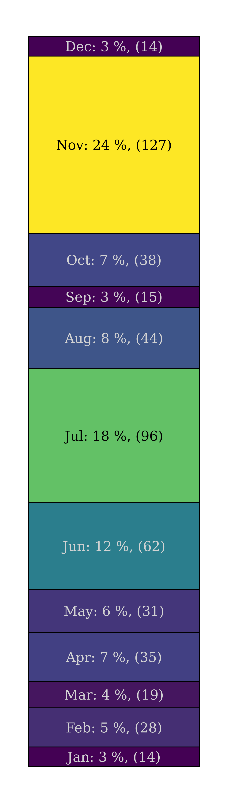
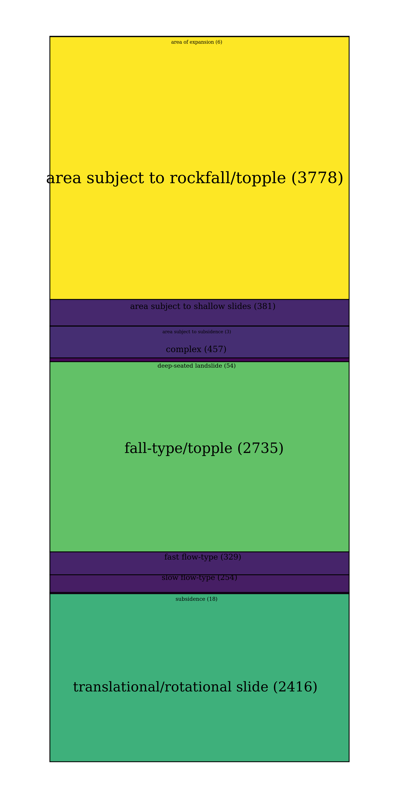
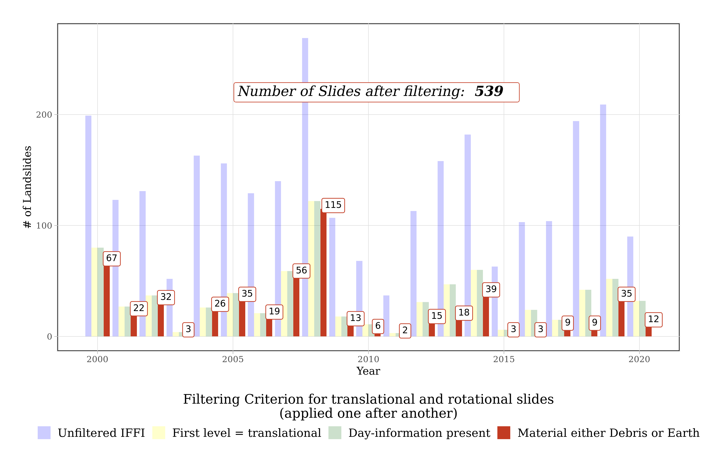
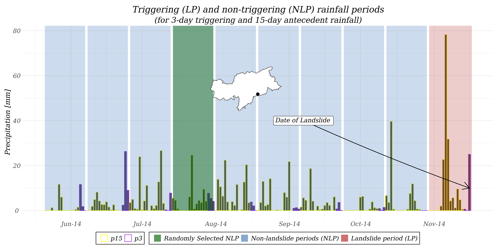

background-image: url(untitled.png)

class: title-slide, middle

```{r, load_refs, include=FALSE, cache=FALSE}
library(RefManageR)
BibOptions(check.entries = FALSE,
           bib.style = "authoryear",
           style = "html",
           hyperlink = FALSE,
           dashed = TRUE)
myBib <- ReadBib("./ref.bib", check = FALSE)
```

## .center.h2b[Robin Kohrs]

<h1 class="titleheader">Rainfall Thresholds for South Tyrol</h1>

--

.center[
  #### (and their challenges)
]

*** 
.center[

Supervisor:

  Dr. Stefan Steger (Eurac)
  
  Dr. Jason Goetz (University of Jena)
]

---


# Overview

1. Goal of the internship

2. The data

3. Anatomy of a rainfall threshold 

  + Deterministic thresholds
  + Probabilistic thresholds

4. Some developed thresholds

5. Conclusions

--

<br>
.center[... much missing]

---

# The internship

- Started in December 2020 and was prolonged in April 2021 (when I also officially started the master's thesis)

- Embedded in the Proslide Project

- Combination of static and dynamic for the analysis and prediction of shallow landslides

  - Subgoal: Develop rainfall thresholds for the Province of South Tyrol 

- I'll show some of the interesting aspects from this process


<span style="color: darkblue"> Source: IFFI database </span>

---

# What is a rainfall threshold?

---

# What is a .white[rainfall] threshold?

--


.center[
```{r, out.width="60%", eval=TRUE, echo=F}
knitr::include_graphics("bamboothreshold.PNG")
```

[Link](https://www.ambientbp.com/product-info/bamboo-thresholds)

]

--

.center.cite[
A threshold is: "the level or point at which you start to experience something, or at which something starts to happen:"
]


[.center[Cambridge Dictionary]](https://dictionary.cambridge.org/dictionary/english/threshold)
---

# What is a .white[rainfall] threshold?

.center[
```{r, out.width="60%", eval=TRUE, echo=F}
knitr::include_graphics("bamboothreshold.PNG")
```

[Link](https://www.ambientbp.com/product-info/bamboo-thresholds)

]


.center.cite[
A threshold is: "the level or point at which you start to experience something, or at which **something starts to happen:**"
]


[.center[Cambridge Dictionary]](https://dictionary.cambridge.org/dictionary/english/threshold)

---

# What is a rainfall threshold?

.cite[A threshold is the minimum or maximum level of some quantity needed for a process to take place or a state to change (White et al, 1996). A minimum threshold defines the lowest level below which a process does not occur. A maximum threshold represents the level above which a process always occurs. For rainfall-induced landslides a threshold may define the rainfall, soil moisture, or hydrological conditions that, when reached or exceeded, are likely to trigger landslides.]

`r Citep(myBib, "Guzzetti_2007")`

---

# What is a rainfall threshold?

.cite[A threshold is the minimum or maximum level of **some quantity** needed for a process to take place or a state to change (White et al, 1996). A **minimum threshold** defines the lowest level below which a process does not occur. A **maximum threshold** represents the level above which a process always occurs. For **rainfall-induced landslides** a threshold may define the rainfall, soil moisture, or hydrological conditions that, when reached or exceeded, are **likely to trigger** landslides.]

`r Citep(myBib, "Guzzetti_2007")`

---

# Anatomy of a threshold:

### Data:
  + Rainfall/Soil moisture/... data
  + Landslide data

### Some quantity to reach/exceed:
 + Event-Intenstiy (I), -Duration (D), -Cumulated rainfall (E) 
 + 3-day cumulated rainfall before slide (p3)
 + 15-day cumulated rainfall before slide (p15)

### A threshold-model to represent reality:
  - A value (1D threshold) 
  - A line (2D threshold) 
  - A probability value (something else)

---

# Data

### Gridded rainfall data

- 250 m spatial resolution / 1 day temporal resolution
- Available for the regions of South Tyrol and Trento as NetCDFs
- Anomaly-based approach / Kriging?
- `r Citet(myBib, "Crespi_2021")`

--

### Landslide Data

- Inventario dei fenomeni franosi in Italia (IFFI) Database
- Gravitational movemets of all types (no avalanches)
- Many variables (including the date, material, extent, ...)
- We received a manual extraction of the database:
  * Ms Access Database
  * Excel Files
  * Shapefiles

--
.dist[

]

.arr[

]

.dist2[

]
---

```{r, out.width="100%", out.height="100%", echo=F}
knitr::include_graphics("mean_monthly_precip.png")
```

---

```{r map, echo=F, warning=F, message=F, out.width="100%", out.height="100%"}
library(mapview)
library(iffitoR)
library(tidyverse)
`Selected Landslides`=filt_landslide %>% select(PIFF_ID, first_level, second_level, date, material)

mapview(`Selected Landslides`,col.regions="steelblue")
```

---

```{r, out.width="100%", out.height="100%", echo=F}

```

---
# More Data

### Station rainfall data

- WISKI Project
- 66 Stations in South Tyrol
- 65 record precipitation in 5 minute, 1 in 10 minute Intervals
- Variable length of recording


### Soil moisture data

- Soilmoisture Content (SMC) data
- Based on Sentinel-1 and Sentinel-2
- Support Vector Regression
- Available on GEE
- `r Citet(myBib, "Attarzadeh_2018")`


---

background-image: url(stations.png)
background-size: 95%

---

background-image: url(sm.png)
background-size: 95%

---
# Some quantity to exceed

.pull-left[
## <u>Event-based quantities</u>

- I => Intensity of a rainfall event [ mm / unit time]

- E => Total depth of a rainfall event [ mm ]

- D => Duration of a rainfall event [ time ]

- Peak intensity, ...

]

.pull-right[
## <u>Antecedent thresholds</u>

- p3 => precipitation 3 days prior to landslide

- p15 => precipitaiton 15 days prior to p3

- Often times try to include some decay function or any other proxy for the water saturation of the soil
]


---

# Some quantity to exceed

.pull-left[
## <u>Event-based quantities</u>

- I => Intensity of a rainfall event [ mm / unit time]

- **E => Total depth of a rainfall event [ mm ]**

- **D => Duration of a rainfall event [ time ]**

- Peak intensity, ...


### .blue[*ED Threshold*]

]

.pull-right[
## <u>Period based thresholds</u>

- **p3 => precipitation 3 days prior to landslide**

- **p15 => precipitaiton 15 days prior to slide**

- Often times try to include some decay function or any other proxy for the water saturation of the soil


### .blue[*3-15 day antecedent threshold*]
]

---

# More quantities to possibly exceed
.ho[
```{r vars, out.width="100%", echo=F}

```
]
<h2 style='margin-top: 0; margin-bottom: 0;'> . . . </h2>
`r Citep(myBib, "Guzzetti_2007a")`

---
# Threshold model

## Quantile regression

  - For *deterministic* thresholds
  - More in just a second

***

## Binary classifiers
   - **Logistic regression**
      + Linear (the logit of the estimated probability) 
      + Interpretable (Yet not like OLS)
      
   - **Generalized Additive Model (GAM)**
      + Semi-parametric extension of GLMs
      + Can capture non-linearities by using e.g. splines 
      + Due to additive structure, still some interpretation possible

---

# Software used

### - R

  + ####and many of its extensions

### - (QGis)

### - Websites: <span style="font-size: 19px;">[Coolers.co](https://coolors.co/), [Stackoverflow](https://stackoverflow.com/), ... </span>


---

# Why R? .small[(and not python)]

```{r ex, echo=F, excercise=T}
knitr::include_app("https://robinkohrs.shinyapps.io/untitled/")
```


---

# Evolution of a rainfall threshold

--

##1. What do we see on the two axes

--

##2. How do we fit the threshold-line

--

##3. Is it possible to do this easier?

--

##4. Where are the problems?

--

##5. There are even more problems?

---

background-image: url(explain1.png)
background-size: 95%

---

background-image: url(explain2.png)
background-size: 95%

---

background-image: url(explain3.png)
background-size: 95%

# What is normally done

---

background-image: url(explain4.png)
background-size: 95%

# What is normally done
---

background-image: url(explain5.png)
background-size: 95%

---

background-image: url(explain6.png)
background-size: 95%

---

background-image: url(explain61.png)
background-size: 95%

---

.center[# Can't this be done easier?]

--

<h2 style='text-align: center;'> Enter quantile regression </h2>
--

<br>

.center[]

---

# Primer on Quantile Regression

<br> 

- Introduced by `r Citet(myBib, "Koenker_1978")`

- Implemented in R in the `quantreg` package `r Citep(myBib, "Koenker_2020")`

- Fits conditional quantiles, rather than the conditional mean (OLS)

- Minimizes the sum of asymmetrically weighted residuals

- More robust against outliers in the response than OLS

- Can handle skewed error distributions better than OLS

- Standard errors are somwehat less straightforward to calculate

--

## - Thus, it leaves roughly 5 % of the data below the line (when the 5 % quantile is fitted)

---
background-image: url(compare_ols_qr.png)
background-size: contain

---

background-image: url(qr01.png)
background-size: 95%
background-position: 50% 80%

# Quantile regression in rainfall thresholds    

---

background-image: url(qr01_arrow.png)
background-size: 95%
background-position: 50% 80%

# But wait...

---
background-image: url(histo0.png)
background-size: 95%
background-position: 50% 80%

# What is a rainfall event?

---
background-image: url(histo1.png)
background-size: 95%
background-position: 50% 80%

# What is a rainfall event?

---

background-image: url(histo2.png)
background-size: 95%
background-position: 50% 80%

# What is a rainfall event?

---

background-image: url(histo3.png)
background-size: 95%
background-position: 50% 80%

# What is a rainfall event?

---
background-image: url(qr03.png)
background-size: 95%
background-position: 50% 80%

# The effect of dry days
---

# How/Why to find the optimal number of dry days
.small2[
- <span style='font-weight: bold; font-size: 160%'> <u> Question: </u> How long does it take for the soil to dry? </span>

- detailed physical knowledge of landslide location necessary

  - Evapotranspiration, Aspect, Slope, soil porosity, permeability, rainfall infiltration, ...

- "The practical background of ID is that [...] it .purple[could be] that precipitation information is a good proxy for both meteorological trigger and hydro- logical cause. Although applied in many case studies, this approach suffers from many false positives as well as .purple[limited physical process understanding]" `r Citep(myBib, "Bogaard_2018")`

- "[...] antecedent soil moisture conditions may provide .purple[critical support] for the correct definition of the triggering conditions." `r Citep(myBib, "Lazarri_2020")`

- "3-day recent rainfall and 15-day antecedent rainfall variables [12,20], are .purple[significantly improved] by merely replacing antecedent rainfall with average .purple[soil saturation measured over the same interval] `r Citep(myBib, "Mirus_2018")`
]

---

## 3-15 day 5 % non-exceedance probability antecedent thresholds

- 3 day precipitation prior to landslide (p3)

- 15 day precipitation prior to p3 (p15)

- Fit a 5 % non-exceedance probability threshold using quantile regression

- No need for defining "rainfall events"

- But where does the decision for the 3 and 15 days come from?

- Look at `r Citep(myBib, map_chr(c("_2000", "_2006", "_2008"), ~paste0("Chleborad", .x)))`

- Intuitive (mostly)

---
background-image: url(ant01.png)
background-size: 95%
background-position: 50% 80%

# Global antecedent thresholds

---
background-image: url(ant01_redpoint.png)
background-size: 95%
background-position: 50% 80%

# Why is the slope almost 0?

---
background-image: url(ant02.png)
background-size: 90%
background-position: 50% 90%
---

# Validation!

## Is it good? Is it bad? Is it somewhere in the middle?

- We need reference (as in real life)

- Validation is (maybe) the most important research frontier for rainfall thresholds

- But it is very complicated as local characteristics will always be different

- It is even more different if one a priori "defines" the missclassification rate

- For the moment being we only have false negatives (missed alarms)

- We define (and accept) there to be 5 % of missed alarms

---

# How to validate a threshold like this?

## Generalization vs Precision...!!
  
  + What is the right scale for a thershold?
  
  + Validating the robustness

  + The smaller the scale is the better the incorporation of local characteristics. Yet, the lower its generalization capabilities
  
  + How can we maybe know out if it ok to use one threshold for entire South Tyrol?
  
  + Distance from false negatives to threshold in a (spatial) cross validation (not really... More a spatial partitioning) 

---

background-image: url(valdeter.png)
background-size: contain

<h1 style='display:inline;'>RMSE </h1> <h2 style='display:inline;'> (of false negatives) </h2>

---

background-image: url(valdeter2.png)
background-size: contain

<h1 style='display:inline;'>RMSE </h1> <h2 style='display:inline;'> (of false negatives) </h2>

---
# Does this feel right?

## What is again the main goal of a threshold?

--

## "separate the storms that lead to shallow landsliding from those that do not" `r Citep(myBib, "Jakob_2003")`

--
  
- Unusual in other common binary classification problems

- The model has no information whatsoever how rainfall events look like that (probably) did not cause landslides

- In addition, these "deterministic" models only ever produce one output for a given input. No uncertainties attached....

- Probability to the rescue: "When different outputs (landslide or no-landslide) can be obtained for the same input a probabilistic approach is preferable" `r Citep(myBib, "Berti_2012")`

--

</img>

.btc[[source: Instagram](https://www.instagram.com/p/CTesubojZUA/)]

---
background-image: url(rp1.png)
background-size: 90%
background-position: 50% 70%

# The "real" problem...
---

background-image: url(rp2.png)
background-size: 90%
background-position: 50% 70%

# Non landslide triggering events (NLE)
---

background-image: url(rp3.png)
background-size: 90%
background-position: 50% 70%

# Many False Alarms 
---

background-image: url(rp4.png)
background-size: 90%
background-position: 50% 70%

<h1 style="display: inline;"> Solution 1 </h1> <span style="display: inline;"> (see Peres et al. 2021) </span>
---

background-image: url(rp5.png)
background-size: 90%
background-position: 50% 70%

# False negatives...
---

.center[<h1 style='top: 20%; position: absolute;'> => Probabilistic Thresholds</h1> <h2 style='top: 25%; position: absolute;'> (rather than deterministic)</h2>]

<span style="position:absolute; top: 50%;"></span>
<span style="position:absolute; top: 87%; left: 70%; color: darkblue"> <a src = "https://media.giphy.com/media/jnULTbYwgDLYsoBbIS/giphy.gif?cid=ecf05e4702520pyvyf752du6coljjjcnuw4amwn0n7ywfdyj&rid=giphy.gif&ct=g"> Source: Giphy </src> </span>
---

# Anatomy of a probailistic thresholds

- We want to predict the probability: $$Pr(landslide=1| \text{rainfall-value})$$

- We need binary labeled data

- Extract triggering and non-triggering rainfall events at landslide locations

--



---
background-image: url(prob1.png)
background-size: contain
--
##.apup[How do we know if this is any good?]

---

background-image: url(prob2.png)
background-size: contain

.nd[New data]

--

---
background-image: url(prob3.png)
background-size: contain

---
background-image: url(prob4.png)
background-size: contain

---
background-image: url(prob5.png)
background-size: contain

---
background-image: url(315_binary.png)
background-size: 95%

# Probabilistic antecedent thresholds

---

# Results

- How to deal with missing physical information?

- We can't obtain the exact rainfall at the landslide location

- Simple, deterministic, thresholds are easy to setup, but depend critically on (arbitratry decision) not coming from the data itself 

- Deterministic thresholds are complicated to validate (What is a good deterministic threshold after all?)

- Probabilistic thresholds seem to be a more statistically sound approach

- Performance of binary classifiers is (surprisingly?) good

- **Dream:** Combination of susceptibility (spatial perspective) and rainfall thresholds (temporal perspective) within a Bayesian statistical approach (using the susceptibility as prior probabilty)

- Future: Satellite data and probabilistic, rainfall thresholds

---
background-image: url(know1.svg)
background-size: contain

# Lessons from this thesis
---
background-image: url(know2.svg)
background-size: contain

# Lessons from this thesis
---

background-image: url(know3.svg)
background-size: contain

# Lessons from this thesis
---
background-image: url(know31.svg)
background-size: contain

# Lessons from this thesis
---
background-image: url(know4.svg)
background-size: contain

---

# Take away

##- With hindsight many things I would have done differently
  + Code
  + Organization
  + Worry less about missing physical information and knowledge

##- Do less, in more depth instead of more shallow

## Occam's Razor (Simplicity over Complexity)

##- Needless to say, but: Do not implement this in any LEWS!
---

# Some links:

## Code & some data:
  - https://github.com/MaThRk
  - https://gitlab.inf.unibz.it/proslide

## Interactive data 
  - https://robinkohrs.shinyapps.io/iffi_data_shiny/
  
## Proslide
  - https://www.mountainresearch.at/proslide/
  
---
# References

.bib[
```{r, results='asis', echo=F, warning=F, message=F}
PrintBibliography(myBib, start=1, end=10)
```
]
 
---

.bib[
```{r, results='asis', echo=F, warning=F, message=F}
PrintBibliography(myBib, start=11, end=14)
```
]

---
.center[<h1 style='position: absolute; top:40%; left: 38%'> Grazie Mille </h1>]
---